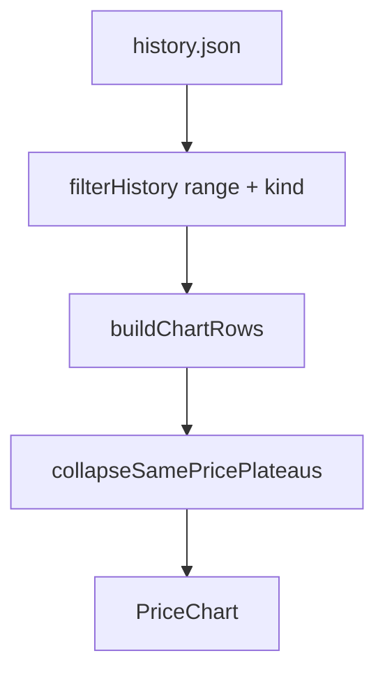

# Logic hiển thị dữ liệu lên chart

Tài liệu mô tả pipeline từ `history.json` → điểm trên biểu đồ (không phụ thuộc scrape).

## Nguồn dữ liệu

| Nguồn | Vai trò |
|-------|---------|
| `public/data/history/{hkn,kkvh,hn}/history.json` | Production |
| `public/data-test/history/...` | Khi `VITE_USE_TEST_DATA=true` |

Mỗi record (`PricePoint`):

```ts
{
  ts: number              // lúc scrape ghi (epoch ms)
  store, kind, label
  buy, sell
  sourceUpdatedAt?: string // giờ tiệm, vd. "19:35:06 06/08/2026"
}
```

**Giá trị Y trên chart:** chỉ **bán ra** (`sell`).  
**Trục X:** thời gian tiệm qua `pointTimeMs` (ưu tiên `sourceUpdatedAt`, không có thì dùng `ts`).

Code: [`src/lib/normalize.ts`](src/lib/normalize.ts) (`pointTimeMs`), [`src/components/StoreTab.tsx`](src/components/StoreTab.tsx), [`src/components/PriceChart.tsx`](src/components/PriceChart.tsx).

## Pipeline

```text
history (tất cả store)
  → filterHistory(range, kinds của tab)
  → buildChartRows          // 1 row / 1 record history
  → collapseSamePricePlateaus
  → PriceChart (Recharts)
       · Line type=linear, connectNulls, dot=false
       · Tooltip / activeDot khi hover
```



## Bước 1 — Lọc theo range & kind

[`filterHistory`](src/lib/history.ts):

- Range: `1D` | `7D` | `30D` | `3M` | `All` (cutoff theo `pointTimeMs`, không theo `ts` crawl)
- Chỉ giữ `kind` của cửa hàng đang mở (HKN / KKVH / HN)

## Bước 2 — Map sang điểm chart

`buildChartRows`:

- Mỗi history record → `{ ts: pointTimeMs(p), [sellKey]: p.sell }`
- Sort tăng dần theo `ts`
- `sellKey`: `nhan_sell` | `sell` | `hn_sell` tùy kind

Không merge live/proxy vào chart — chỉ data trong history file.

Scrape chỉ **ghi** history khi `sourceUpdatedAt` đổi (xem [CRAWL.md](CRAWL.md)); plateau cùng giá trên chart vẫn xảy ra khi tiệm đổi giờ cập nhật nhưng `sell` không đổi.

## Bước 3 — Gộp plateau cùng giá

`collapseSamePricePlateaus` — rút gọn **đỉnh đường** (không liên quan chấm marker):

- Duyệt theo thời gian
- **Bỏ** điểm giữa nếu `sell == điểm trước` **và** `sell == điểm sau`
- **Giữ** đầu + cuối mỗi đoạn giá không đổi → đoạn ngang đúng khoảng thời gian trên trục X

| Input (sell theo thời gian) | Output chart |
|-----------------------------|--------------|
| 100 → 100 → 100 | giữ đầu + cuối (2 đỉnh, đoạn ngang) |
| 100 → 100 → 105 | đầu(100), cuối plateau(100), rồi 105 |
| 100 → 105 (cách 30 phút) | **giữ cả 2** (khác giá, không gộp) |

History.json **không** bị xóa record — chỉ rút gọn khi vẽ.

## Bước 4 — Vẽ (PriceChart)

Phong cách giống chart vàng phổ biến (Kitco / TradingView line mặc định): **đường trước, chi tiết qua hover**.

- Line `type="linear"` (không `monotone` — tránh cong giữa các scrape sát nhau)
- `connectNulls`
- **`dot={false}`** — không vẽ marker cố định (đầu/cuối plateau sát nhau trên 30D nhìn rối)
- Hover: `activeDot` + tooltip (`toLocaleString('vi-VN')` theo epoch X)

Đường vẫn đi qua mọi đỉnh sau bước 3; chỉ ẩn chấm. Hai đỉnh khác giá sát giờ trên filter dài vẫn đúng về data — dùng hover hoặc filter `1D`/`7D` để đọc chi tiết.

## Label “Nguồn cập nhật” trên StoreTab

Lấy từ **điểm cuối history** của kind (`latestPoint`), không lấy giờ proxy live — khớp điểm cuối chart / JSON.

Phần `(cách lần cập nhật trước đó …)`: khoảng thời gian giữa tip và **mẫu history liền trước** cùng kind (`previousPoint` không lọc giá) — không phải “lần đổi giá gần nhất”, cũng không phải tuổi so với lúc mở trang. Format: [`formatElapsed`](src/lib/normalize.ts) — `40 phút` | `1 tiếng` | `1 tiếng 30 phút` (không gắn chữ “trước”).

`SellDelta` (+/− đ) vẫn dùng `previousPoint(..., current)` để tìm mẫu **khác giá** gần nhất.

## File liên quan

| File | Việc |
|------|------|
| [`src/lib/history.ts`](src/lib/history.ts) | `filterHistory`, `latestPoint`, `previousPoint` |
| [`src/lib/normalize.ts`](src/lib/normalize.ts) | `pointTimeMs`, `sourceUpdatedAtToMs` |
| [`src/components/StoreTab.tsx`](src/components/StoreTab.tsx) | build + collapse + truyền `PriceChart` |
| [`src/components/PriceChart.tsx`](src/components/PriceChart.tsx) | Recharts line-only, domain Y |
| [`CRAWL.md`](CRAWL.md) | Cách scrape **ghi** history (khác UI chart) |
